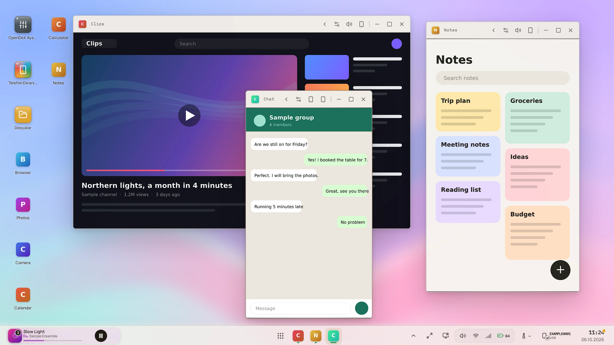
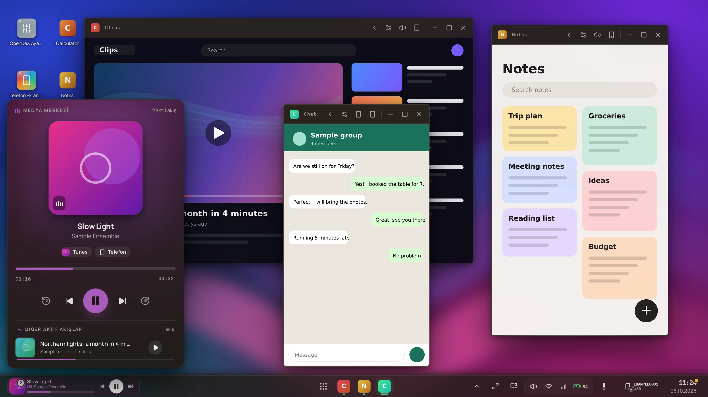
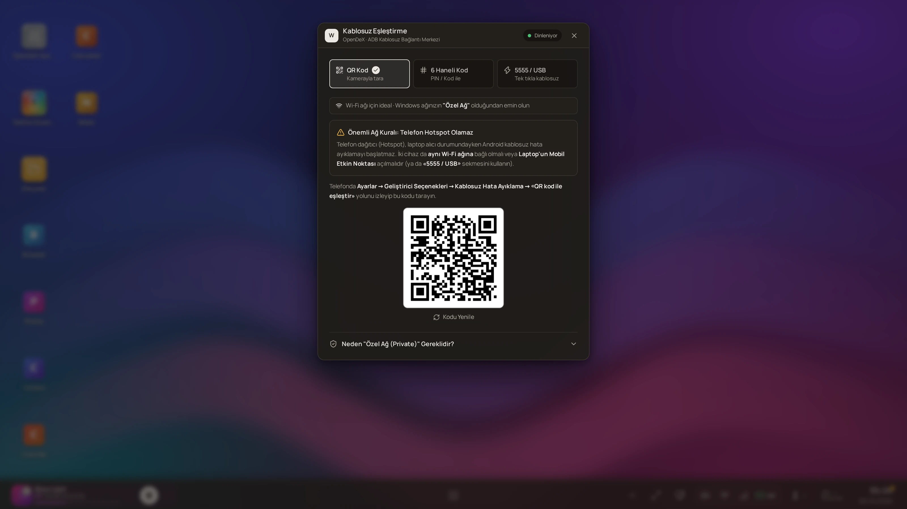

<div align="center">

# OpenDeX

**Turn your Android phone into a multi-window desktop on your computer.**
Every app runs in its own window — resizable, side by side — with its own sound, a taskbar, a launcher, a file manager and your notifications.

[](LICENSE)


[](https://github.com/Lordof21/OpenDex/actions/workflows/backend-ci.yml)

[Download](#download) · [Install](docs/INSTALL.md) · [Documentation](docs/README.md) · [API](docs/API.md) · [Architecture](docs/ARCHITECTURE.md) · [Contributing](CONTRIBUTING.md) · [Türkçe](README.tr.md)

<picture>
  <source media="(prefers-color-scheme: dark)" srcset="docs/images/hero-dark.webp">
  
</picture>

<sub>Real OpenDeX interface; the phone apps in the windows are sample illustrations — see [how the screenshots are made](tools/screenshots/README.md).</sub>

</div>

## Download

**Windows (x64)** — take the latest build from the [`download/`](download/) folder of this repository (checksums in `SHA256SUMS.txt`) or from the [Releases page](https://github.com/Lordof21/OpenDex/releases):

| File | What it is |
|---|---|
| `OpenDeX_0.1.0_x64_tr-TR.msi` | Installer |
| `OpenDeX_0.1.0_windows-x64_portable.zip` | Portable — unzip and run `opendex.exe`; nothing is installed |

Each release lists the SHA-256 checksums. The builds are **unsigned**, so Windows SmartScreen may warn (*More info → Run anyway*).
You also need `adb` on your `PATH` and USB debugging on the phone — see [Install](docs/INSTALL.md). This is pre-1.0 software and the installer
has not yet been tried on a clean machine ([what is verified](docs/DEVICE_COMPATIBILITY.md)). To build it yourself: [Building and releasing](docs/BUILD_AND_RELEASE.md).

## What it is

Screen mirroring shows your phone's *one* screen in *one* window. OpenDeX gives **each app its own virtual display** on the phone and shows it in **its own window** on the computer,
so you can run several apps at once, resize them like desktop windows, hand one back to the phone and take it again. The phone's hardware encoder produces the video; nothing is installed on
the phone and no root is needed — OpenDeX drives it over `adb`, building on [scrcpy](https://github.com/Genymobile/scrcpy)'s server.

> **Status: pre-1.0.** Verified on one phone (Xiaomi POCO X7 Pro, Android 16) and on Windows. Expect rough edges elsewhere — [what is and is not verified](docs/DEVICE_COMPATIBILITY.md).
> The interface is currently **Turkish only** (English is the first roadmap item); the code, API and documentation are English.

## Features

<table>
<tr>
<td width="50%"><br><b>Launcher & taskbar.</b> Every phone app, searchable (<kbd>Ctrl</kbd>+<kbd>K</kbd>), each opening in its own window.</td>
<td width="50%"><br><b>Workspace.</b> Several freeform tasks share one virtual display — no extra encoder per window.</td>
</tr>
<tr>
<td><br><b>Per-app audio.</b> Send each app's sound to the phone, the computer or both — kept in step, with a microphone-assisted calibration. <a href="docs/AUDIO.md">How</a></td>
<td><br><b>File manager.</b> Browse the phone and the PC, copy and move between them, resume big transfers, preview photos, video, PDF and Office files.</td>
</tr>
<tr>
<td><br><b>Media Center & notifications.</b> Control whatever is playing on the phone; open notifications from the desktop and reply where the app allows it.</td>
<td><br><b>Battery that tells the truth.</b> Health, who is charging how fast, time to full — a value the phone does not report is shown as "—", never invented.</td>
</tr>
<tr>
<td><br><b>Phone Load.</b> CPU, temperature and what OpenDeX itself asks of the phone, with plain-language findings ("why is it warm?").</td>
<td><br><b>Wired or wireless.</b> USB, or QR / code pairing over Wi-Fi; switch between them without losing windows.</td>
</tr>
</table>

More: quick settings (Wi-Fi, Bluetooth, torch, volumes), a device centre, light and dark themes, window snapping, hand-off of an app to the phone and back, short-drop recovery
(windows freeze on their last frame and resume), and a [boot screen](docs/images/boot.webp) that shows what is actually happening.

## Quick start

1. Install Android **platform-tools** (`adb`) and turn on **USB debugging** on the phone (Android 10+).
2. Install OpenDeX — or run it from source (below). *No release has been published yet; see [BUILD_AND_RELEASE.md](docs/BUILD_AND_RELEASE.md).*
3. Plug the phone in, accept the prompt, open OpenDeX. No phone yet? The pairing dialog opens.

Full steps, requirements per Android version and first-run help: **[docs/INSTALL.md](docs/INSTALL.md)**.

### From source

```bash
# backend → http://127.0.0.1:8710                      # frontend → http://localhost:5173
cd backend                                              cd frontend
python -m pip install -e ".[dev]"                       npm ci
python -m app.main                                      npm run dev
```

Python 3.11+, Node 18+, `adb` on `PATH`. More (native window, tests, conventions): **[docs/DEVELOPMENT.md](docs/DEVELOPMENT.md)**.

## How it fits together

```
 React UI (Tauri window) ⇄  REST /api/v1 + WebSockets  ⇄  Python backend  ⇄ adb ⇄  scrcpy-server × N  +  OpenDexDaemon
   windows · taskbar · files                (local, token)      sessions, relay       (one per window)       (one helper process)
```

The backend is a **local HTTP/WebSocket API** — the bundled UI is just one client of it, so you can script OpenDeX or write your own client.
What the API, the OpenAPI file and the WebSockets are for: **[docs/API.md](docs/API.md)**. The parts and how a window goes from "click" to pixels: **[docs/ARCHITECTURE.md](docs/ARCHITECTURE.md)**.

## Privacy and security

Local only: no accounts, no cloud, no telemetry, no update check. The API listens on loopback and is protected by an Origin/Host guard (other web pages) and a bearer token (other programs);
the phone helper authenticates mutually with the backend. OpenDeX does enable a few Android *developer multi-window* settings that stay on — read
[docs/SECURITY_MODEL.md](docs/SECURITY_MODEL.md) before you rely on it. Report vulnerabilities as described in [SECURITY.md](SECURITY.md).

## Documentation

| | |
|---|---|
| Use it | [Install](docs/INSTALL.md) · [Troubleshooting](docs/TROUBLESHOOTING.md) · [FAQ](docs/FAQ.md) · [Device compatibility](docs/DEVICE_COMPATIBILITY.md) |
| Understand it | [Architecture](docs/ARCHITECTURE.md) · [Audio](docs/AUDIO.md) · [Security model](docs/SECURITY_MODEL.md) |
| Build on it | [API](docs/API.md) · [API reference](docs/api/REFERENCE.md) · [OpenAPI](docs/api/openapi.json) · [Configuration](docs/CONFIGURATION.md) |
| Change it | [Development](docs/DEVELOPMENT.md) · [Testing](docs/TESTING.md) · [Phone helper protocol](docs/DAEMON_PROTOCOL.md) · [Build & release](docs/BUILD_AND_RELEASE.md) |
| Where it is going | [Roadmap](docs/ROADMAP.md) · [Changelog](CHANGELOG.md) |

## Contributing

Bug reports, phone-compatibility reports and pull requests are welcome — start with [CONTRIBUTING.md](CONTRIBUTING.md) and the [code of conduct](CODE_OF_CONDUCT.md). A change that touches the window
manager, the audio path or the phone helper needs a check on a real phone ([checklist](docs/DEVICE_CHECKLIST.md)).

## License

[GPL-3.0-or-later](LICENSE). OpenDeX builds on [scrcpy](https://github.com/Genymobile/scrcpy) (Apache-2.0) and other open-source components —
[THIRD_PARTY_NOTICES.md](THIRD_PARTY_NOTICES.md). "Android" is a trademark of Google LLC; OpenDeX is not affiliated with or endorsed by Google, Samsung or Genymobile.
