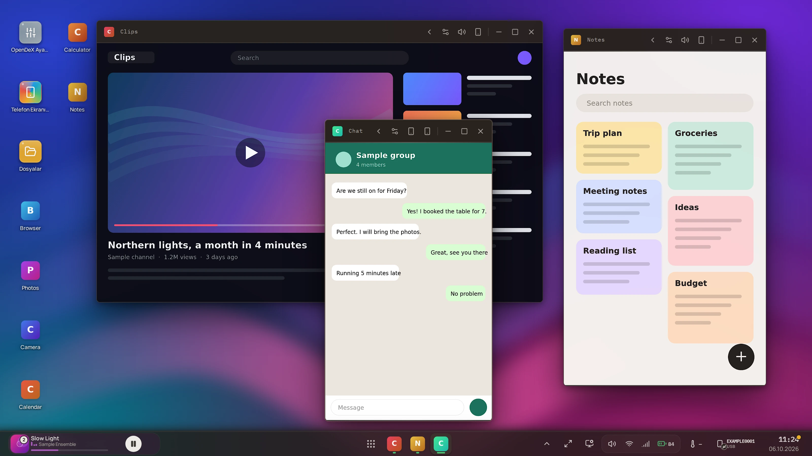
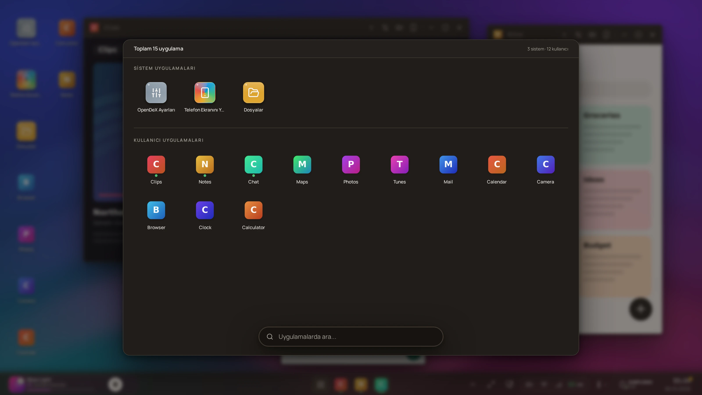
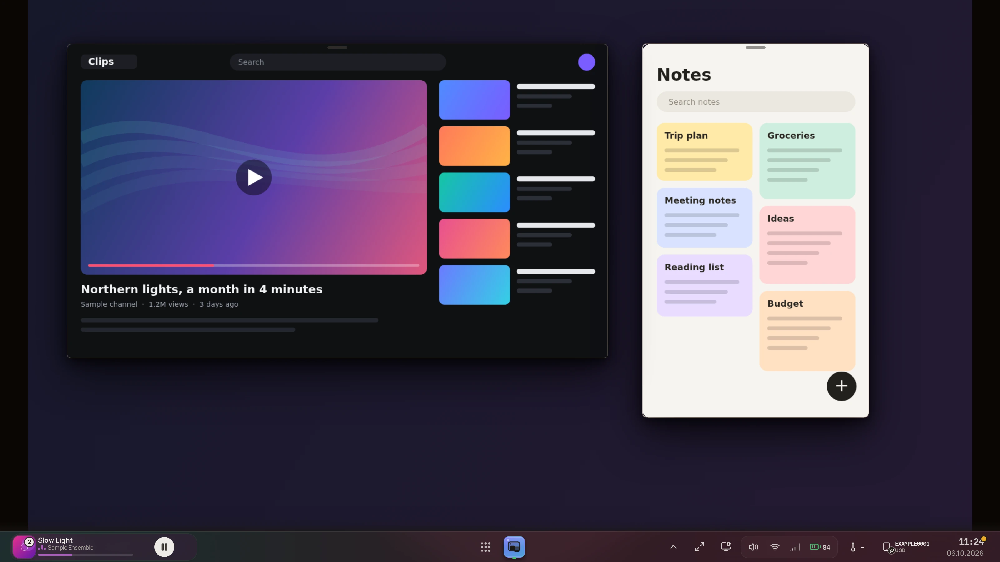
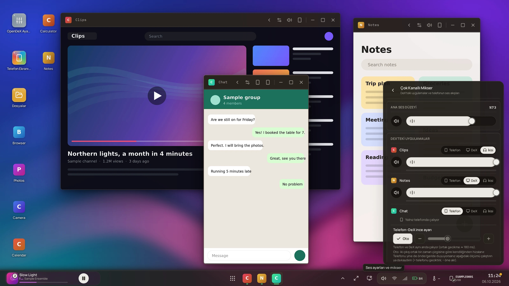
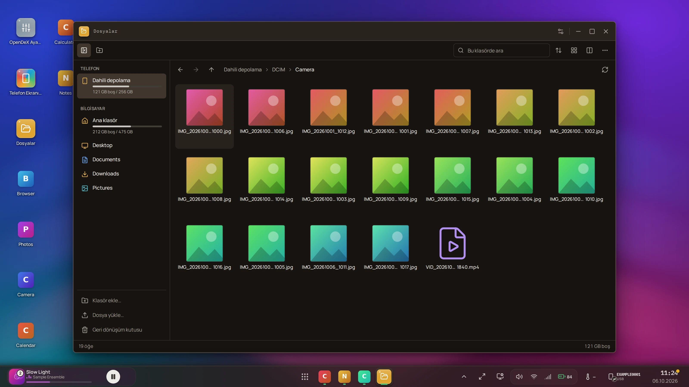
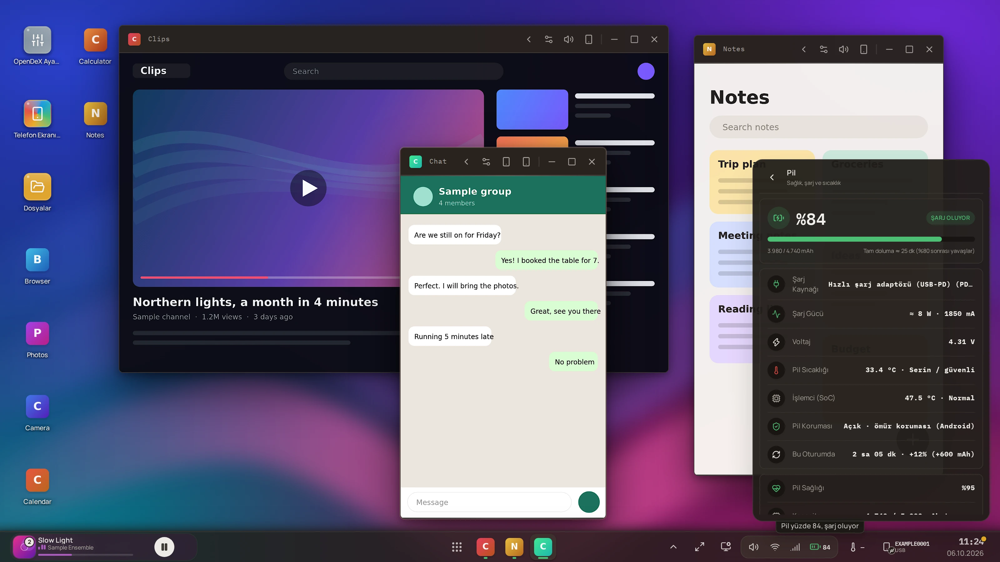
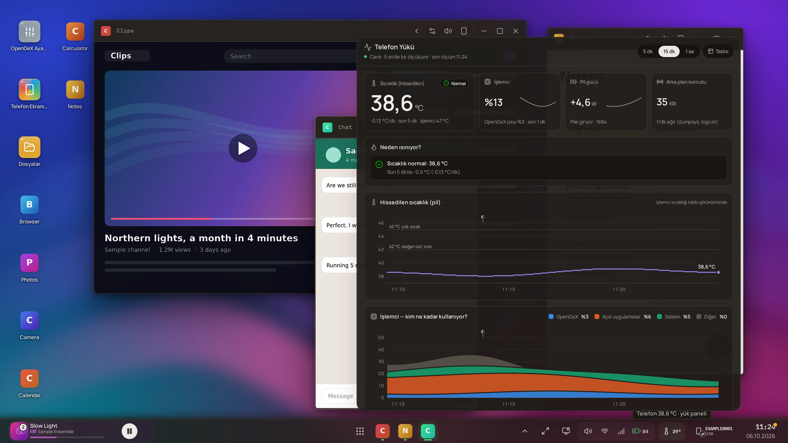

# OpenDeX

**Android telefonunu bilgisayarda çok pencereli bir masaüstüne dönüştür.**
Her uygulama kendi penceresinde — yan yana, yeniden boyutlandırılabilir — kendi sesi, görev çubuğu, başlatıcısı, dosya yöneticisi ve bildirimleriyle.

[English](README.md) · [Sürümler ve indirme](#sürümler-ve-indirme) · [Kurulum](docs/INSTALL.md) · [Dokümantasyon](docs/README.md) · [API](docs/API.md) · [Mimari](docs/ARCHITECTURE.md)

Gerçek OpenDeX arayüzü; pencerelerdeki uygulamalar örnek çizimlerdir — [ekran görüntüleri nasıl üretiliyor](tools/screenshots/README.md).

## Sürümler ve indirme

**Windows (x64)** — en son sürümü bu deponun [`download/`](download/) klasöründen (sağlama toplamları `SHA256SUMS.txt` içinde) ya da [Releases sayfasından](https://github.com/Lordof21/OpenDex/releases) indirin:

| Dosya | Ne olduğu |
|---|---|
| `OpenDeX_0.1.0_x64_tr-TR.msi` | Kurulum paketi |
| `OpenDeX_0.1.0_windows-x64_portable.zip` | Taşınabilir — zip'i açıp `opendex.exe`'yi çalıştırın; bir şey kurulmaz |

Her sürümde SHA-256 sağlama toplamları listelenir. Sürümler **imzasızdır**; Windows SmartScreen uyarabilir (*Ek bilgi → Yine de çalıştır*).
Ayrıca `PATH`'te `adb` ve telefonda USB hata ayıklama gerekir — [Kurulum](docs/INSTALL.md). Bu 1.0 öncesi bir yazılımdır ve kurulum paketi henüz temiz bir
bilgisayarda denenmemiştir ([neyin doğrulandığı](docs/DEVICE_COMPATIBILITY.md)). Kendiniz derlemek için: [Derleme ve yayın](docs/BUILD_AND_RELEASE.md).

## Nedir?

Ekran yansıtma, telefonun **tek** ekranını **tek** pencerede gösterir. OpenDeX her uygulamaya telefonda **kendi sanal ekranını** verir ve bilgisayarda **kendi penceresinde** gösterir: birden çok uygulamayı aynı anda
çalıştırır, masaüstü penceresi gibi boyutlandırır, birini telefona geri verip yeniden alabilirsiniz. Görüntüyü telefonun donanım kodlayıcısı üretir; telefona uygulama kurulmaz, root gerekmez —
OpenDeX telefonu `adb` ile sürer ve [scrcpy](https://github.com/Genymobile/scrcpy)'nin sunucusu üzerine kuruludur.

> **Durum: 1.0 öncesi.** Tek telefonda (Xiaomi POCO X7 Pro, Android 16) ve Windows'ta doğrulandı — [neyin doğrulandığı](docs/DEVICE_COMPATIBILITY.md). Arayüz şimdilik **yalnızca Türkçe**; kod, API ve dokümanlar İngilizce.

## Özellikler

| | |
|---|---|
|  | **Başlatıcı ve görev çubuğu** — her telefon uygulaması aranabilir (<kbd>Ctrl</kbd>+<kbd>K</kbd>), kendi penceresinde açılır |
|  | **Workspace** — birkaç serbest pencere tek sanal ekranı paylaşır (pencere başına ek kodlayıcı yok) |
|  | **Uygulama başına ses** — her uygulamanın sesi telefona, bilgisayara ya da ikisine; mikrofonla otomatik hizalama ([nasıl](docs/AUDIO.md)) |
|  | **Dosya yöneticisi** — telefon ve PC, aralarında kopyala/taşı, büyük aktarımı sürdür, fotoğraf/video/PDF/Office önizleme |
|  | **Dürüst pil sayfası** — sağlık, şarj hızı, tam doluma süre; telefonun bildirmediği değer "—" gösterilir, uydurulmaz |
|  | **Telefon Yükü** — CPU, sıcaklık, OpenDeX'in telefondan ne istediği ve sade dille bulgular |

## Hızlı başlangıç

1. Android **platform-tools** (`adb`) kurun, telefonda **USB hata ayıklamayı** açın (Android 10+).
2. OpenDeX'i kurun ya da kaynaktan çalıştırın (henüz yayımlanmış sürüm yok — [BUILD_AND_RELEASE](docs/BUILD_AND_RELEASE.md)).
3. Telefonu takın, istemi onaylayın, OpenDeX'i açın. Telefon yoksa eşleştirme penceresi açılır.

Ayrıntılar: **[docs/INSTALL.md](docs/INSTALL.md)** (İngilizce). Kaynaktan çalıştırma: backend için `cd backend && python -m pip install -e ".[dev]" && python -m app.main`, frontend için `cd frontend && npm ci && npm run dev`.

## API ne işe yarar?

Backend, **yerel bir HTTP/WebSocket API**'dir; hazır arayüz bunun yalnızca bir istemcisidir. REST uçları komut ve okuma içindir, WebSocket'ler canlı veri (video, ses, dokunma, olaylar) içindir,
`docs/api/openapi.json` ise REST API'nin makine tarafından okunabilir tarifidir (Swagger/Postman'e verilir ya da istemci üreticiyle kendi dilinizde tipli istemci çıkarılır). Ayrıntı: **[docs/API.md](docs/API.md)**.

## Gizlilik ve güvenlik

Yalnızca yerel: hesap, bulut, telemetri, güncelleme denetimi yok. API yalnızca geri döngü adresinde dinler; başka web sayfalarına karşı Origin/Host koruması, başka programlara karşı taşıyıcı anahtar vardır.
OpenDeX telefonda birkaç Android *geliştirici çoklu pencere* ayarını açık bırakır — kullanmadan önce [docs/SECURITY_MODEL.md](docs/SECURITY_MODEL.md) dosyasını okuyun. Açık bildirimi: [SECURITY.md](SECURITY.md).

## Katkı ve lisans

Hata ve telefon uyumluluğu bildirimleri, pull request'ler memnuniyetle karşılanır: [CONTRIBUTING.md](CONTRIBUTING.md). Lisans: [GPL-3.0-or-later](LICENSE); üçüncü taraf bileşenler: [THIRD_PARTY_NOTICES.md](THIRD_PARTY_NOTICES.md).
Cihazda doğrulama listesi (Türkçe): [docs/DEVICE_CHECKLIST.md](docs/DEVICE_CHECKLIST.md).
