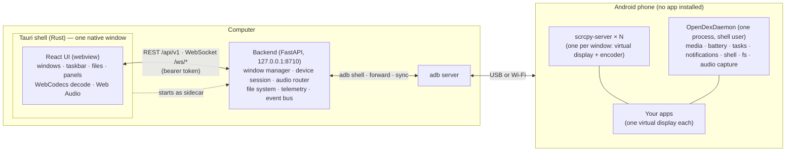
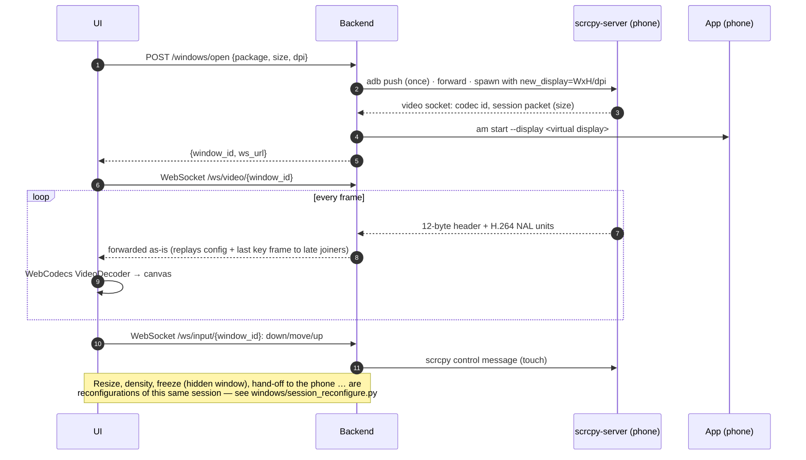
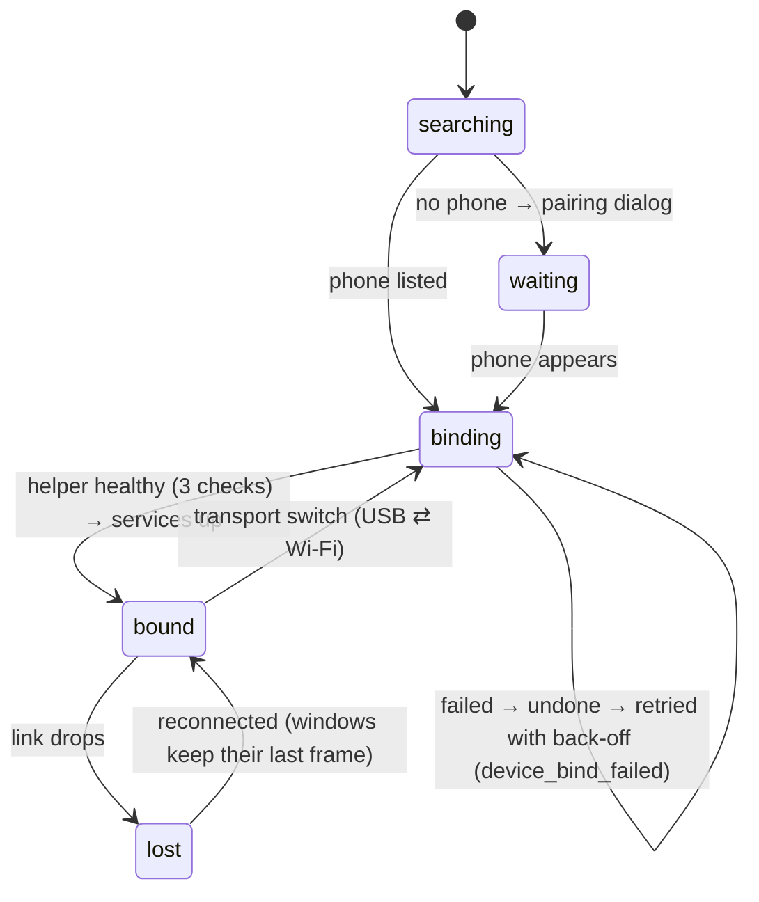

# Architecture

OpenDeX turns an Android phone into a multi-window desktop on a computer. Each app runs on **its own virtual display on the phone**,
is encoded there by the phone's hardware encoder, and is shown in **its own window** on the computer; touch and keyboard go back the
same way. This page is the map: the parts, how they talk, and the decisions that shape the code.

## The parts

* **UI** (`frontend/`) — a React single-page app. It owns *presentation* and window geometry; it decides nothing about the phone.
  Hosted by a Tauri shell (`frontend/src-tauri/`) that gives it a native window and starts the backend as a *sidecar*; the same UI also
  runs in a browser against a dev server.
* **Backend** (`backend/app/`) — the only thing that talks to `adb`. It keeps **one bound phone** (a *session*), opens/closes windows, relays
  streams, and turns phone state into events. It is local-only by construction ([SECURITY_MODEL.md](SECURITY_MODEL.md)).
* **scrcpy-server** (`backend/vendor/`) — upstream scrcpy's phone-side program (v4.1), plus four small OpenDeX patches
  ([`backend/scrcpy/`](../backend/scrcpy/README.md)): faster, simpler virtual-display resize and an on-demand key frame. One instance per
  window; it creates the virtual display, runs the app on it, encodes it (H.264/HEVC) and receives touch/keys.
* **OpenDexDaemon** (`backend/java/`, built into `opendex-tools.jar`) — one long-lived Java process on the phone that answers the questions
  `adb shell` would be too slow for and **pushes** what changes. [DAEMON_PROTOCOL.md](DAEMON_PROTOCOL.md).

## Processes and ports

| | Where | Port / socket |
|---|---|---|
| Backend API + WebSockets | PC | `127.0.0.1:8710` |
| Vite dev server (development only) | PC | `127.0.0.1:5173` |
| Daemon control (forwarded) | PC ↔ phone | `127.0.0.1:28100` ↔ `localabstract:opendex_daemon` |
| Daemon audio PCM (forwarded) | PC ↔ phone | `127.0.0.1:28101` ↔ `localabstract:opendex_audio` |
| scrcpy video/audio/control, per window | PC ↔ phone | `adb forward` to `localabstract:scrcpy_<scid>` (random local port) |

## One window, end to end

The key properties: **no transcoding** on the PC (the phone's hardware encoder produces what the browser decodes); **bounded queues
everywhere** (a slow consumer loses old frames at key-frame boundaries — never corrupts the picture and never slows the phone); and
**a window is a session** (`WindowSession`: its server, display, sockets, size, density) that can be frozen, resized, handed to the
phone and taken back without being rebuilt from scratch.

## The device session

The backend tracks phones through adb's own device list (`device_tracker`, a standing `host:track-devices-l`, no polling) and
binds **one**. Bringing it up is all-or-nothing (`AppContext.bind_device`) and visible to the UI as it happens:

`GET /startup` and the boot screen read this state; `devices_changed` / `device_lost` / `device_reconnected` keep the UI in step
([API.md → events](API.md#event-types)). Short drops (a few seconds) do not close windows: they freeze on their last frame and resume.

## The backend, by package

| Package | Responsibility |
|---|---|
| `api/` | HTTP routes (`v1/endpoints`), the WebSocket surface, and the **middleware that enforces the rules** (token, Origin guard, body limit, security headers); the public OpenAPI export |
| `device/` | `adb` wrapper, device discovery and tracking, the **daemon client** (+ its mutual authentication), battery/Wi-Fi/Bluetooth/notification services, connection supervision, display power |
| `windows/` | the **window manager** and everything about a window's life: scrcpy launch, resize, density policy and the *density reconciler*, freeze/unfreeze, hand-off and reclaim, the shared **Workspace** (several freeform tasks on one display), task movement |
| `streams/` | video socket reader, frame **broadcaster** (fan-out with GOP-safe back-pressure), session audio and the **per-app audio** router/link |
| `input/` | touch and keyboard injection over the scrcpy control socket; the "no finger stays stuck" tracker |
| `fs/` | the **file manager**: PC and phone providers behind one contract, a transfer engine (copy/move between any two places), `adb sync` client, previews, thumbnails, trash |
| `telemetry/` | per-app CPU, per-window stream rates, the *Phone Load* monitor and its plain-language findings, a meter of what OpenDeX asks of the phone |
| `wireless/` | mDNS discovery and QR / code pairing |
| `apps/` | the phone's app list and icons |
| `storage/` | SQLite (settings, layouts, saved devices) and private-file helper |
| `schemas/` | Pydantic models; `identifiers.py` is the input-validation boundary for anything that reaches a shell |
| `events.py` | the event bus and the `EventType` list that is the UI's contract |

Wiring is explicit: `AppContext` (in `main.py`) owns the long-lived services and is read through `app.state.ctx`; routes depend on it
(`api/deps.py`) and never build their own.

## The frontend, by folder

`desktop/` (wallpaper, icons, launcher) · `window/` (window frames, the video canvas, the Workspace canvas, window store) · `taskbar/`
(taskbar and every panel: quick settings, audio mixer, media center, battery, devices) · `files/` (the file manager) · `media/` (decode
pipeline, audio players, sync calibration) · `settings/` · `notifications/` · `telemetry/` (Phone Load) · `wireless/` (pairing) ·
`startup/` (boot screen) · `state/` (Zustand stores) · `events/` (the `/ws/events` client) · `lib/` (API client, token, logger) · `ui/`
(design-system parts). The frontend↔backend contract is pinned by `frontend/tests/apiContract.test.js` (paths) and
`frontend/tests/fixtures/` (event and input message shapes).

## Design decisions worth knowing

1. **Virtual displays, not mirroring.** Mirroring the phone's screen cannot show two apps at once. A virtual display per app can; the
   phone's own screen is left alone (and can be switched off while OpenDeX runs).
2. **A daemon instead of shelling out.** Polling `adb shell dumpsys …` costs tens of milliseconds and a process on the phone *each time*,
   and heats it. The daemon reads in-process and pushes changes; every capability has an `adb shell` fallback.
3. **Events over polling.** State the UI shows (devices, media, battery, tasks) is pushed on `/ws/events`; the UI reads once at connect.
4. **Local-only, two independent locks.** An Origin/Host guard keeps other web pages out; a bearer token keeps other programs out
   ([SECURITY_MODEL.md](SECURITY_MODEL.md)).
5. **One owner per decision.** Density, resize, audio routing and window-app lifecycle each have a reconciler that derives the desired state
   from the current facts and converges on it — a missed trigger costs latency, not correctness.
6. **Honest numbers.** A figure that cannot be measured is `null` and the UI shows "—"; derived figures say they are estimates.
7. **Generated documentation.** The API reference, configuration reference and protocol tables are generated from code and checked in CI
   ([DEVELOPMENT.md](DEVELOPMENT.md#generated-files--do-not-edit-by-hand)).

## What is deliberately not here

No cloud, accounts or telemetry upload; no iOS (the platform does not allow it); no Linux packaging yet; no multi-phone sessions (one bound phone at a time);
no keyboard app on the phone (characters are injected as key codes, and the few without one — `ç ğ ı ö ş ü …` — through scrcpy's clipboard/paste path; see [FAQ.md](FAQ.md)).
