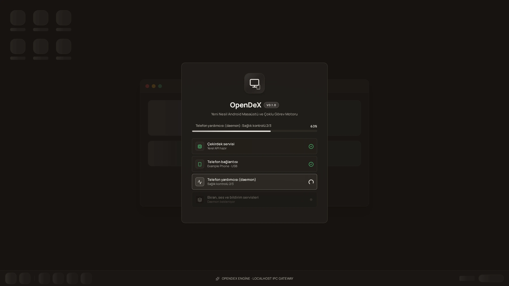

# Installing and first run

OpenDeX is a **desktop app plus a helper on the phone**. Nothing is installed on the phone — OpenDeX starts its helper
(a small Java process) with `adb`, the same way `scrcpy` starts its server.

> **Status.** OpenDeX is pre-1.0 and has been verified on one phone (see [DEVICE_COMPATIBILITY.md](DEVICE_COMPATIBILITY.md)) and on
> Windows. Expect rough edges on other phones; please report them ([issue forms](../.github/ISSUE_TEMPLATE)).

## What you need

| | |
|---|---|
| **Computer** | Windows 10/11 is the supported desktop. The Tauri packaging also targets macOS (`.dmg`) but that build has not been verified. Linux can run the backend and tests but there is no packaged app. |
| **adb** | Google's *Android platform-tools* (`adb`). OpenDeX does **not** bundle it: install it and put it on `PATH`, or set `OPENDEX_ADB_PATH` to the executable ([CONFIGURATION.md](CONFIGURATION.md)). |
| **Phone** | **Android 10 (API 29) or newer.** Developer options on, **USB debugging** on. For wireless: Android 11+ *Wireless debugging*. Full feature set — per-app audio — needs **Android 13+** (below). |
| **Cable or Wi-Fi** | USB for the lowest latency; Wi-Fi (same network, not a hotspot hosted *by the phone*) works too. |
| **WebView** | Windows: Microsoft Edge WebView2 (present on Windows 11 and current Windows 10). It must be able to decode H.264/HEVC (WebCodecs); OpenDeX tells you at start-up if it cannot. |

### What works on which Android version

| Android | Mirror windows (virtual displays) | Audio | Notes |
|---|---|---|---|
| 10 (API 29) | ✔ | — | Minimum: launching an app on a virtual display needs API 29. |
| 11–12 (30–32) | ✔ | one **session** stream (all phone sound, scrcpy's audio capture) | Wireless debugging and QR pairing start at 11. |
| **13+ (33+)** | ✔ | **per-app audio**: route each app to *Phone* / *DeX* / *Both*, with the cross-device sync | The `AudioPolicy` playback capture used for it needs API 33. |

Smaller differences: from Android 12 (API 31) OpenDeX can restart just an app's *process* in place after a density change; before it, the app is relaunched.

## Install

1. Install **platform-tools** and check `adb version` in a terminal.
2. Download the installer from the repository's **Releases** page and run it.
   *(No release has been published yet. Until then, build it yourself — [BUILD_AND_RELEASE.md](BUILD_AND_RELEASE.md) — or run
   from source — [DEVELOPMENT.md](DEVELOPMENT.md).)*
3. Start **OpenDeX**.

## Prepare the phone

1. **Settings → About phone →** tap *Build number* seven times (Developer options appear).
2. **Settings → System → Developer options →** turn on **USB debugging**. On some phones (Xiaomi/HyperOS and a few others) also
   turn on the *"USB debugging (Security settings)"* switch — without it, injected touch is refused.
3. Optional, for cable-free use (Android 11+): turn on **Wireless debugging**.

## First run

The boot screen walks through what is actually happening — the local API, the phone, the helper's health check, the services:

* **Phone plugged in by USB:** accept the *"Allow USB debugging?"* prompt on the phone (tick *Always allow*). OpenDeX finds the
  phone, starts its helper and opens the desktop.
* **No phone yet:** the pairing dialog opens by itself.

  

  *QR code* — on the phone: Developer options → Wireless debugging → **Pair device with QR code**, and scan. *6-digit code* —
  the same screen, **Pair device with pairing code**. *5555 / USB* — switch a USB-connected phone to Wi-Fi in one click. The
  **computer and the phone must be on the same network**, and the network must be *Private* on Windows; a phone that is itself
  hosting a hotspot to the laptop cannot do wireless debugging.
* **If the helper does not answer** within three health checks, OpenDeX says so ("continuing with ADB") and keeps working through
  `adb`, only slower.

Once the desktop is up, open apps from the launcher (`Ctrl+K`), the desktop icons or the taskbar; each app opens in its own window on
its own virtual display. [README → Features](../README.md#features) shows what is where.

## Where OpenDeX keeps things

| What | Where |
|---|---|
| API token (the one secret between the UI and the local backend) | `~/.opendex/api-token` (mode 0600) |
| Helper key (backend ↔ phone) | `~/.opendex/daemon-token` |
| File manager shell token | `~/.opendex/shell-token` |
| Settings, window layouts, saved devices, file-manager favourites | `~/.opendex/settings.db` (SQLite) |
| Logs | `logs/` next to the backend (rotating, 10 MB × 5; at start, files older than 7 days are deleted and the folder is trimmed to 150 MB) — `OPENDEX_LOG_DIR` moves them |
| On the phone | `/data/local/tmp/opendex-tools.jar`, `/data/local/tmp/opendex-scrcpy-server.jar`, `/data/local/tmp/opendex-daemon.log` (and a small `opendex-screen-blanked` marker while the panel is switched off by OpenDeX) — nothing else; remove them with `adb shell rm` if you ever want a clean phone |

Everything is local. OpenDeX makes **no** network calls of its own: no telemetry, no update check, no accounts. (Your computer
talks to your phone over `adb`; the UI talks to the backend on `127.0.0.1:8710`.)

## Uninstall

Uninstall the app from Windows' *Apps* list, delete `~/.opendex/`, and (optionally) remove the files listed above from the phone.

**Heads-up:** to make freeform windows work, OpenDeX turns on a few Android *developer* multi-window settings on the phone
(`enable_freeform_support`, `force_resizable_activities`, …). They **stay on** after you uninstall. They are harmless to most people but not
nothing; the full list and the `adb` commands that undo them are in
[SECURITY_MODEL.md → What OpenDeX changes on the phone](SECURITY_MODEL.md#what-opendex-changes-on-the-phone). Everything else it changes
while running (the phone staying awake while charging, a panel it switched off, density of a virtual display) is restored when the session ends.

## Problems

[TROUBLESHOOTING.md](TROUBLESHOOTING.md) has the usual causes and the log lines to look for.
